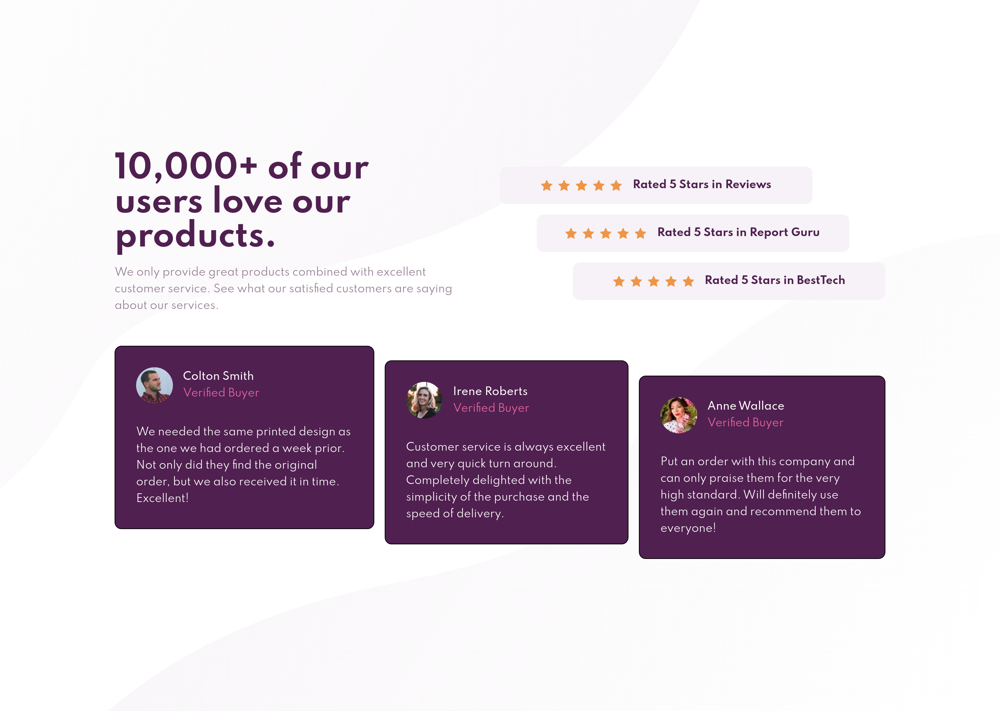
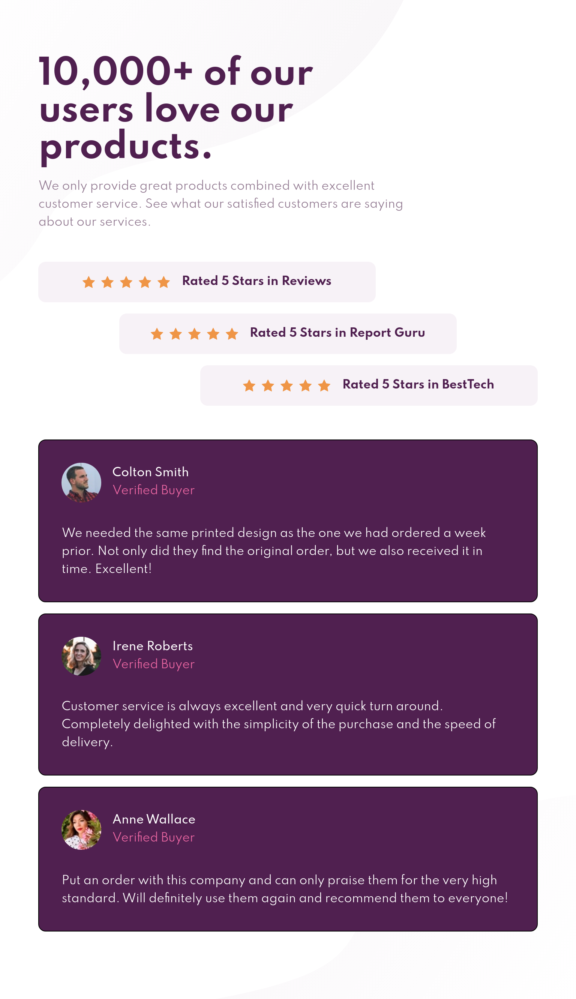
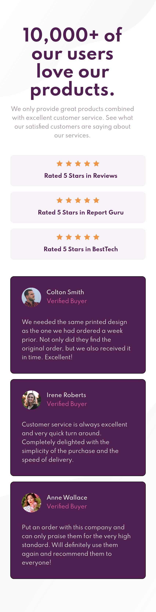

# Frontend Mentor - Social proof section solution

This is a solution to the [Social proof section challenge on Frontend Mentor](https://www.frontendmentor.io/challenges/social-proof-section-6e0qTv_bA). Frontend Mentor challenges help you improve your coding skills by building realistic projects.

## Table of contents

-   [Overview](#overview)
    -   [The challenge](#the-challenge)
    -   [Screenshot](#screenshot)
    -   [Links](#links)
-   [My process](#my-process)
    -   [Built with](#built-with)
    -   [What I learned](#what-i-learned)
    -   [Continued development](#continued-development)
    -   [Useful resources](#useful-resources)
-   [Author](#author)
-   [Acknowledgments](#acknowledgments)

## Overview

### The challenge

Users should be able to:

-   View the optimal layout for the section depending on their device's screen size

### Screenshot





### Links

-   Solution URL: [Github Repository](https://github.com/juani2/social-proof-section-master--solution)
-   Live Site URL: [Netlify](https://dreamy-bassi-17eed6.netlify.app/)

## My process

### Built with

-   Semantic HTML5 markup
-   Vanilla CSS
-   Flexbox
-   Graceful Degradation
-   Typography and Layout Dependend Breakpoints

### What I learned

On this challenge, I was able to exercise my media queries and flexbox.
Diagonal arrangement of cards and ratings can be easily achieved using `align-self` properties of flexbox.

Diagonal Rating Implementation

```css
.customer-ratings .rating:nth-child(1) {
    align-self: flex-start;
}
.customer-ratings .rating:nth-child(2) {
    align-self: center;
    margin: 1rem 0;
}
.customer-ratings .rating:nth-child(3) {
    align-self: flex-end;
}
```

Diagonal Card Implementation

```css
.card:nth-child(1) {
    align-self: flex-start;
}
.card:nth-child(2) {
    align-self: center;
    margin: 0 1rem;
}
.card:nth-child(3) {
    align-self: flex-end;
}
```

In this challenge, what really consumed my time was finding the appropriate layout and breakpoints as the screen size changes. The breakpoints established on this solution was not based on common device breakpoints but rather dependent on typography max-width.
max-width was used because I prefer to use graceful degradation rather than mobile first approach on this challenge.

```css
@media screen and (max-width: 960px) {}
@media screen and (max-width: 885px) {}
@media screen and (max-width: 600px) {}
```

Subtle responsive behavior were implemented on rating component. Depending on available screen space, the flow of 5-star rating and the rating name changes from column to row.


### Continued development

The responsiveness of card components were very jarry as you move the screen size from big to small. Further study and experimentation is needed to further improve user experience.
Further layout consideration is also needed on tablet viewports. The card components seemed to be too wide.

### Useful resources

-   [Mozilla developer Network](https://www.developer.mozilla.org)

## Author

-   Github - [juani2](http://github.com/juani2)
-   Frontend Mentor - [@juani2](https://www.frontendmentor.io/profile/juani2)

## Acknowledgments

I want to give thanks to Frontend mentor team and all those challengers that posts their solution. It really helped me in pulling this challenge off.